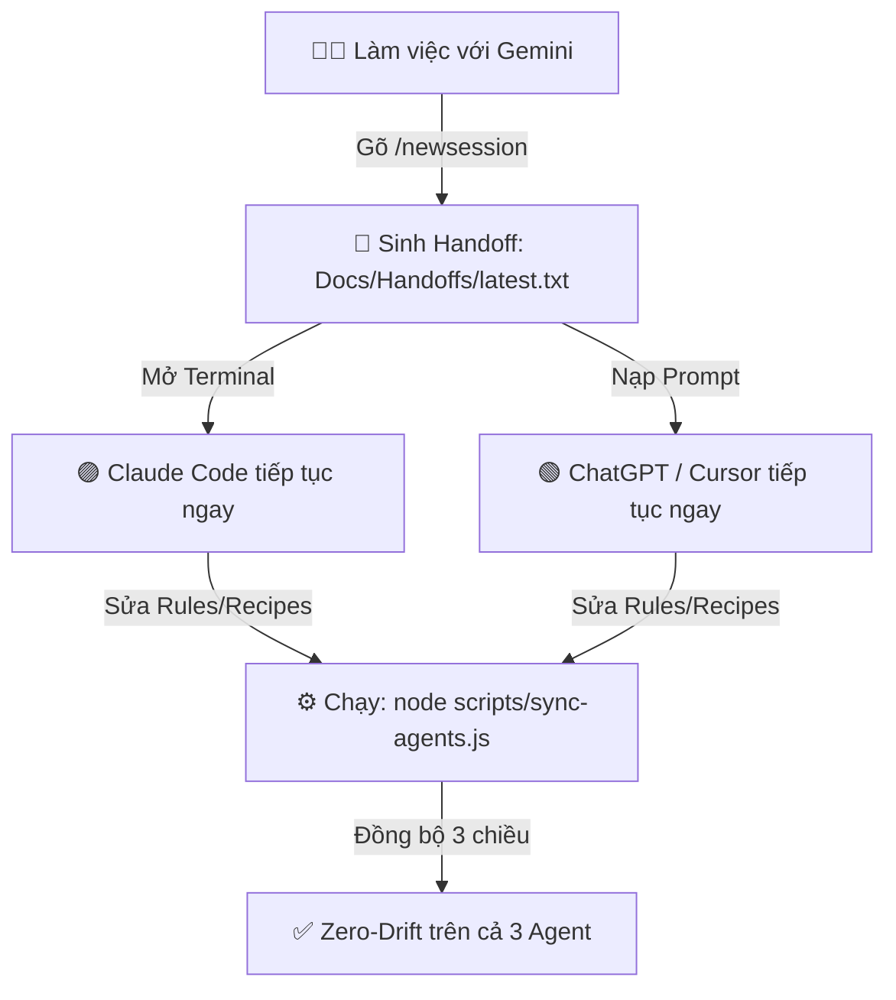

# 🚀 AgentUnity — Universal AI Agent Framework for Unity

<p align="center">
  
  
  
  
  
  
  
</p>

> **AgentUnity** là bộ khung cấu hình, quy tắc an toàn, automation hooks, subagents và mẫu kiến trúc C# chuẩn hoá dành riêng cho **Đa AI Agent (Google Gemini / Antigravity, Anthropic Claude Code, OpenAI ChatGPT / Copilot / Cursor)** khi lập trình cặp (*Pair-Programming*) trên các dự án Unity Engine.

---

# Mục lục
1. [Điểm Nổi Bật & Triết Lý Thiết Kế](#1-điểm-nổi-bật--triết-lý-thiết-kế)
2. [Ma Trận Tính Năng Đa Agent (Tri-Agent Matrix)](#2-ma-trận-tính-năng-đa-agent-tri-agent-matrix)
3. [Bản Đồ Cấu Trúc Hệ Thống](#3-bản-đồ-cấu-trúc-hệ-thống)
4. [Cài Đặt Tự Động 1 Lệnh (1-Command Quick Install)](#4-cài-đặt-tự-động-1-lệnh-1-command-quick-install)
5. [Quy Trình Tự Động Onboarding Cho Dự Án Mới](#5-quy-trình-tự-động-onboarding-cho-dự-án-mới)
6. [Hệ Thống Trụ Cột Cốt Lõi (Core Modules)](#6-hệ-thống-trụ-cột-cốt-lõi-core-modules)
   - [6.1. Bảo Vệ An Toàn Asset & 8 Bẫy Ngầm Unity MCP](#61-bảo-vệ-an-toàn-asset--8-bẫy-ngầm-unity-mcp)
   - [6.2. 11 Architecture Recipes (Mẫu Code C# Chuẩn)](#62-11-architecture-recipes-mẫu-code-c-chuẩn)
   - [6.3. Hệ Thống Rules & Knowledge Graph Điều Hướng 2 Tầng](#63-hệ-thống-rules--knowledge-graph-điều-hướng-2-tầng)
   - [6.4. Slash Commands & Subagents](#64-slash-commands--subagents)
   - [6.5. Quản Trị Living Docs & Worklog Fragments](#65-quản-trị-living-docs--worklog-fragments)
7. [Cơ Chế Bàn Giao Chéo (Cross-Agent Handoff) & Auto-Sync](#7-cơ-chế-bàn-giao-chéo-cross-agent-handoff--auto-sync)
8. [Quy Chuẩn Pair-Programming](#8-quy-chuẩn-pair-programming)

---

# 1. Điểm Nổi Bật & Triết Lý Thiết Kế

- 🛡️ **Bảo Vệ Toàn Vẹn Asset Unity (Safety Guard):** Chặn cứng AI sửa đè trực tiếp các file `.prefab`, `.unity`, `.asset`, `.meta` bằng text tool, ngăn ngừa 100% lỗi mất liên kết ngầm (broken GUID / FileID).
- ⚡ **Zero-GC Allocations & High-Performance C#:** Cưỡng chế quy chuẩn tối ưu bộ nhớ trong GameLoop (`Update`, `LateUpdate`, Coroutines, Events, NonAlloc Physics).
- 🔄 **Universal Tri-Agent Ecosystem:** Hỗ trợ song song và đồng bộ 3 chiều giữa **Google Gemini** (Antigravity), **Anthropic Claude Code**, và **OpenAI ChatGPT / Copilot / Cursor**.
- 🤝 **Bàn Giao Chéo Liền Mạch (Cross-Agent Handoff):** Đóng session ở Gemini -> Mở Claude Code hoặc ChatGPT tiếp tục làm việc ngay lập tức mà không bao giờ rơi rớt ngữ cảnh.
- ⚡ **Vòng Lặp Phản Hồi Siêu Tốc:** Thiết lập kiến trúc Assembly Definitions (`.asmdef`) phân tầng giúp thời gian compile mã nguồn C# luôn đạt **< 1 giây**.
- 🔗 **Tích Hợp Sâu Unity MCP Server:** Cẩm nang và bộ phòng vệ 8 bẫy ngầm khi điều khiển Unity Editor trực tiếp qua MCP.
- 🚀 **1-Command Install & Auto-Onboarding:** Cài đặt toàn bộ bộ khung bằng 1 dòng lệnh duy nhất, AI tự phỏng vấn và hoàn thiện config dự án.

---

# 2. Ma Trận Tính Năng Đa Agent (Tri-Agent Matrix)

| Tính Năng / Năng Lực | 🟢 Google Gemini (Antigravity) | 🟣 Anthropic Claude Code | 🟢 OpenAI ChatGPT / Copilot / Cursor |
| :--- | :---: | :---: | :---: |
| **Entry Point File** | `AGENTS.md` (Root) | `CLAUDE.md` (Root) | `CHATGPT.md` / `.cursorrules` (Root) |
| **Thư Mục Cấu Hình** | `.agents/` | `.claude/` | `.openai/` & `.github/` |
| **Lifecycle Safety Hooks** | ✅ `PreToolUse`, `PreInvocation` | ✅ Hook scripts & permissions | 🛡️ Instructions & Linter guard |
| **Slash Commands** | ✅ 10 Skills (`.agents/skills/`) | ✅ 10 Commands (`.claude/commands/`) | 📋 Prompt Templates (`Docs/prompts/`) |
| **Subagents Chuyên Trách** | 🔄 Subagent spawning | ✅ 4 Agents (`.claude/agents/`) | 🤖 Custom GPTs / Assistants |
| **Shared Living Docs** | ✅ `Docs/` (100% Chung) | ✅ `Docs/` (100% Chung) | ✅ `Docs/` (100% Chung) |
| **3-Way Auto Sync Tool** | ✅ `node scripts/sync-agents.js` | ✅ `node scripts/sync-agents.js` | ✅ `node scripts/sync-agents.js` |

---

# 3. Bản Đồ Cấu Trúc Hệ Thống

```text
AgentUnity/
├── AGENTS.md & AGENTS_TEMPLATE.md     # 🟢 Entry points cho Google Gemini (Antigravity)
├── CLAUDE.md & CLAUDE_TEMPLATE.md     # 🟣 Entry points cho Claude Code
├── CHATGPT.md & CHATGPT_TEMPLATE.md   # 🟢 Entry points cho ChatGPT & OpenAI
├── .cursorrules                       # 🔵 Cấu hình quy chuẩn cho Cursor IDE
├── .github/
│   └── copilot-instructions.md        # 🐙 Hướng dẫn quy chuẩn cho GitHub Copilot
├── .editorconfig                      # 📐 Cưỡng chế quy chuẩn định dạng C# Unity
├── .gitattributes                     # 📦 Cấu hình Git LFS cho Binary Assets & Text Diff
├── .gitignore                         # 🚫 Chặn file rác Library/, Temp/, Logs/ Unity 6 & LTS
├── install.ps1                        # ⚡ Script cài đặt tự động 1 lệnh cho Windows (PowerShell)
├── install.sh                         # ⚡ Script cài đặt tự động 1 lệnh cho macOS & Linux (Bash)
├── README.md                          # 📖 Tài liệu tổng quan bộ khung
│
├── scripts/
│   └── sync-agents.js                 # 🔄 Công cụ tự động đồng bộ 3 chiều Rules & Recipes
│
├── .agents/                           # 🟢 Bộ công cụ cho Antigravity (Gemini)
│   ├── hooks.json                     # Cấu hình Lifecycle Hooks
│   ├── hooks/                         # Scripts bảo vệ an toàn, linter C#, context guards
│   ├── rules/                         # 4 Rules chuẩn hóa (Always-on & Model-decision)
│   ├── recipes/                       # 11 Architecture Recipes mẫu C#
│   └── skills/                        # 10 Kỹ năng mở rộng (/convention-check, /test-run...)
│
├── .claude/                           # 🟣 Bộ công cụ cho Claude Code
│   ├── settings.json                  # Cấu hình quyền thực thi & MCP servers
│   ├── rules/ & recipes/ & hooks/     # Rules, Recipes và Hooks đồng bộ
│   ├── commands/                      # 10 Slash Commands (.md)
│   └── agents/                        # 4 Subagents chuyên trách (auditor, reviewer, refactor, tester)
│
├── .openai/                           # 🟢 Bộ công cụ cho ChatGPT & OpenAI
│   └── rules/ & recipes/              # Rules và Recipes đồng bộ
│
└── Docs/                              # 🌟 SHARED LIVING DOCS (100% Dùng Chung)
    ├── SourceOfTruth/                 # Thiết kế game (GDD) & Spec kỹ thuật chuẩn
    ├── Decisions/                     # Nhật ký quyết định kiến trúc (ADR)
    ├── Handoffs/                      # Mẫu bàn giao phiên làm việc & Prompt handoff
    ├── QC/                            # Checklist kiểm thử chất lượng (QC01, QC02)
    ├── Done/                          # Worklog fragments lưu trữ task đã đóng (.txt)
    └── prompts/                       # Kịch bản prompt nhanh & mẫu câu lệnh MCP
```

---

# 4. Cài Đặt Tự Động 1 Lệnh (1-Command Quick Install)

Mở Terminal tại **thư mục gốc của bất kỳ dự án Unity nào** và chạy 1 lệnh duy nhất:

### Cho Windows (PowerShell):
```powershell
irm https://raw.githubusercontent.com/hieu180704/AgentUnity/main/install.ps1 | iex
```

### Cho macOS & Linux (Bash):
```bash
curl -fsSL https://raw.githubusercontent.com/hieu180704/AgentUnity/main/install.sh | bash
```

---

# 5. Quy Trình Tự Động Onboarding Cho Dự Án Mới

Ngay sau khi chạy lệnh cài đặt, bạn chỉ cần mở dự án với bất kỳ AI Agent nào:

```text
🧑‍💻 Dev: "Bắt đầu setup dự án"
🤖 AI: "Chào bạn! Tôi phát hiện dự án mới cần Onboarding. Hãy cho tôi biết:
        1. Tên dự án game của bạn?
        2. Thể loại & Gameplay loop chính (2D/3D, core loop)?
        3. Unity Version & Render Pipeline (URP/HDRP/Built-in)?
        4. Các thư viện Third-party (UniTask, DOTween, Odin, Zenject...)?"
🧑‍💻 Dev: [Trả lời 4 câu hỏi]
🤖 AI: "✅ Đã tự động cập nhật AGENTS.md, CLAUDE.md & CHATGPT.md! Chúng ta sẵn sàng pair-programming!"
```

---

# 6. Hệ Thống Trụ Cột Cốt Lõi (Core Modules)

### 6.1. Bảo Vệ An Toàn Asset & 8 Bẫy Ngầm Unity MCP
Nằm tại `rules/unity-safety.md`:
- **Chặn sửa đè YAML:** Cấm tuyệt đối dùng text tool can thiệp `.prefab`, `.unity`, `.asset`, `.meta`.
- **8 Bẫy ngầm runtime:**
  1. *Lệch tên Property:* `Graphic`/`Image` dùng field serialized (`m_Color`), `RectTransform` dùng public API (`sizeDelta`).
  2. *UI Child rỗng:* GameObject con tạo trong Canvas không tự thêm `RectTransform`.
  3. *Wire Reference:* Luôn đọc ngược lại (read-back verify) sau khi gán tham chiếu.
  4. *Kiểm tra GUID:* Dùng `AssetDatabase.GUIDToAssetPath`, không grep path trong `Assets/`.
  5. *Lưu Asset chọn lọc:* Dùng `SaveAssetIfDirty`, tránh gọi `SaveAssets` toàn bộ khi scene dirty.
  6. *Timeout MCP:* Timeout không đồng nghĩa lệnh hỏng; luôn check `git diff` trước khi retry.
  7. *Git Revert:* Revert asset qua git phải kích hoạt Unity Editor `Refresh`/`ImportAsset`.
  8. *Snippet Code:* Chạy dưới dạng Method-Body; dùng Fully-Qualified Types thay vì `using`.

### 6.2. 11 Architecture Recipes (Mẫu Code C# Chuẩn)
Nằm tại `recipes/` (Tra cứu tại `00-recipe-index.md`):

| Tên Recipe | Mục Đích Sử Dụng | Đặc Điểm Kỹ Thuật |
| :--- | :--- | :--- |
| **`recipe-manager`** | System Manager & Service Controller | Khởi tạo 2 pha (`Initialize`/`Shutdown`), Anti-null, Singleton an toàn |
| **`recipe-ui-panel`** | Màn hình, Popup, Navigation | `CanvasGroup` fading, `blocksRaycasts`, chặn click xuyên thấu |
| **`recipe-event`** | Event Bus & C# Events type-safe | Payload `readonly struct`, zero-alloc, auto unbind `OnDisable` |
| **`recipe-save-data`** | Persistence & Data Migration | `schemaVersion`, `CreateDefault()`, tự động migrate dữ liệu cũ |
| **`recipe-scriptableobject`** | Game Configs & Catalog tĩnh | Read-only properties, validation dữ liệu trong Editor |
| **`recipe-statemachine`** | Finite State Machine (FSM) | Enum-driven, phân tách rõ `Enter`, `Update`, `Exit` |
| **`recipe-tween`** | DOTween Animations | Cưỡng chế `DOKill`, unscaled time cho UI khi pause game |
| **`recipe-pool`** | Object Pooling hiệu năng cao | Tái sử dụng `UnityEngine.Pool.ObjectPool`, Zero GC Alloc |
| **`recipe-constants`** | Hằng số tập trung | Centralized Tags, Layers, Scenes, `StringToHash` |
| **`recipe-unit-test`** | Unit Test tự động (NUnit) | EditMode & PlayMode Test, khép kín vòng lặp TDD |
| **`recipe-asmdef`** | Assembly Definitions | Phân tầng modularity 1 chiều, Compile Time < 1s |

### 6.3. Hệ Thống Rules & Knowledge Graph Điều Hướng 2 Tầng
- **Tầng 1 (Dispatcher Node-0):** `knowledge-graph.md` điều hướng chính xác domain cần tra cứu, ngăn ngừa việc scan/grep toàn bộ repository tốn kém hàng chục ngàn tokens.
- **Tầng 2 (Leaf Nodes):** `Docs/SourceOfTruth/<Domain>/spec.txt` mô tả sâu logic, call flow và danh sách class cốt lõi.

### 6.4. Slash Commands & Subagents
- **10 Slash Commands:** `/convention-check`, `/test-run`, `/worktree`, `/move-file-unity`, `/newsession`, `/explain`, `/unity-mcp-guide`, `/doc`, `/restructure-script`, `/system-cleanup`.
- **4 Subagents chuyên trách (Claude Code):** `unity-auditor` (kiểm toán asset), `code-reviewer` (review GC & conventions), `refactor-expert` (tách God Class), `qa-tester` (kiểm thử NUnit).

### 6.5. Quản Trị Living Docs & Worklog Fragments
- Cấu trúc `Docs/` tinh gọn: `SourceOfTruth`, `Decisions` (ADR), `Handoffs`, `QC`, `prompts`, `Done`.
- Worklog fragments dạng `Docs/Done/YYYY-MM-DD__<task-name>.txt` ghi nhận minh bạch mọi mốc hoàn thành.

---

# 7. Cơ Chế Bàn Giao Chéo (Cross-Agent Handoff) & Auto-Sync

Bộ khung cho phép chuyển đổi linh hoạt giữa các AI Engine mà không mất ngữ cảnh:



---

# 8. Quy Chuẩn Pair-Programming

Mọi AI Agent khi làm việc trong hệ thống AgentUnity đều phải tuân thủ nghiêm ngặt:
1. **Quy trình 4 pha bắt buộc:** `explore -> propose -> confirm -> execute`. Dừng lại ở mỗi pha để tóm tắt và chờ người dùng xác nhận (`confirm`), không tự ý nhảy cóc.
2. **Tiêu chuẩn chất lượng:** *Correct, minimal, verifiable* — giải quyết triệt để nguyên nhân gốc rễ (Root Cause), không vá tạm triệu chứng.
3. **Đọc trước khi làm:** Trích dẫn dòng cụ thể (`filename:Lxx-Lyy`) để có thể verify. "Đọc lại" nghĩa là đọc từ đầu file, không dựa trên trí nhớ.
4. **Không Over-Scope:** Làm đúng phạm vi yêu cầu, không tự tiện refactor hay dọn dẹp các file ngoài phạm vi.
5. **Trung thực & Thẳng thắn:** Phát hiện sai sót giữa chừng → báo ngay cho người dùng, không âm thầm patch.

---

<p align="center">
  <b>Được phát triển với niềm đam mê dành cho cộng đồng Unity Game Developers 🎮</b>
</p>
